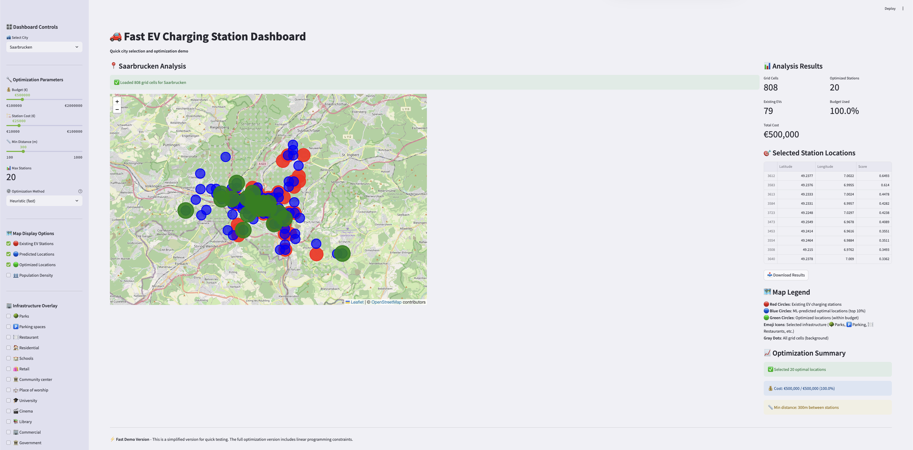
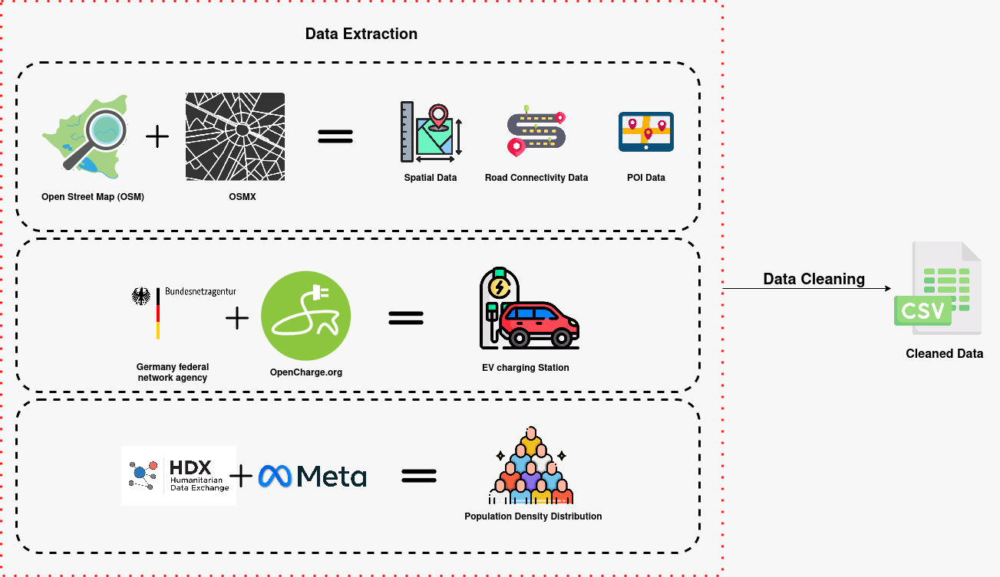

# 🚗⚡ Optimal EV Charging Station Placement



## 📋 Table of Contents

- [About The Project](#about-the-project)
- [Key Features](#key-features)
- [Methodology](#methodology)
- [Dashboard Screenshot](#dashboard-screenshot)
- [Installation & Setup](#installation--setup)
- [Project Structure](#project-structure)
- [Data Sources](#data-sources)
- [Machine Learning Models](#machine-learning-models)
- [Optimization Techniques](#optimization-techniques)
- [Usage](#usage)
- [Results](#results)
- [Team Members](#team-members)
- [Acknowledgments](#acknowledgments)
- [Citation](#citation)
- [Contact](#contact)

## 🎯 About The Project

The global transportation sector faces critical challenges due to internal combustion engines (ICEs), including significant contributions to global warming. With fossil fuel depletion and greenhouse gas emissions raising climate change concerns, there's an urgent need to transition to cleaner alternatives like Electric Vehicles (EVs).

**Our Solution:**
This project presents a comprehensive data science approach to optimally place EV charging stations using:
- **Machine Learning Classification** for demand prediction
- **Linear Programming (LP)** for constraint-based optimization
- **Particle Swarm Optimization (PSO)** for complex optimization scenarios
- **Interactive Dashboard** for real-time analysis and visualization

### Key Objectives:
- ✅ Create exhaustive datasets considering socio-demographic features of German cities
- ✅ Develop ML models to predict optimal EV charging station locations
- ✅ Implement multiple optimization techniques (LP, PSO) for station placement
- ✅ Build an interactive dashboard for decision-makers
- ✅ Evaluate and compare different ML algorithms for optimal performance

## ✨ Key Features

### 🗺️ Interactive Dashboard
- **Multi-City Support**: Analyze Berlin, Munich, Frankfurt, Stuttgart, Saarbrucken, and more
- **Real-time Optimization**: Adjust budget, station costs, and constraints dynamically
- **Visual Analytics**: Interactive maps with multiple data layers
- **Infrastructure Overlay**: View parks, restaurants, schools, and other POIs with emoji icons
- **Export Functionality**: Download analysis results and optimized locations

### 🤖 Machine Learning Pipeline
- **Binary Classification**: Predict suitable locations for EV stations
- **Feature Engineering**: Population density, POI counts, road connectivity
- **Model Comparison**: Tested 15+ ML algorithms
- **Cross-validation**: Robust model evaluation and selection

### ⚙️ Optimization Methods
- **Linear Programming**: Constraint-based optimization with CVXPY
- **Particle Swarm Optimization**: Metaheuristic approach for complex scenarios
- **Heuristic Scoring**: Fast approximation for real-time analysis
- **Budget Constraints**: Cost-aware station selection

## 🔬 Methodology

### 1. Data Collection & Preprocessing
- **Geospatial Data**: OpenStreetMap integration for city boundaries and infrastructure
- **Socio-economic Data**: Population density, commercial areas, residential zones
- **POI Data**: Restaurants, schools, universities, parking spaces, government buildings
- **EV Station Data**: Existing charging infrastructure from German Federal Network Agency

### 2. Feature Engineering
```python
# Key features used in the model
features = [
    'population', 'restaurant', 'commercial', 'parking_space',
    'school', 'university', 'park', 'library', 'government',
    'residential', 'edges', 'nodes'
]
```

### 3. Machine Learning Pipeline
- **Data Splitting**: City-based train/test splits to prevent data leakage
- **Binary Classification**: Convert continuous EV station counts to binary (0/1)
- **Model Training**: 15+ scikit-learn classifiers tested
- **Performance Metrics**: Accuracy, Precision, Recall, F1-Score, ROC-AUC

### 4. Optimization Framework
- **Demand Scoring**: ML predictions converted to demand scores
- **Constraint Definition**: Budget, minimum distance, maximum stations
- **Objective Function**: Maximize coverage while minimizing costs
- **Solution Methods**: LP (exact) and PSO (approximate)

## 📊 Dashboard Screenshot


*The interactive dashboard showing Saarbrucken analysis with optimized EV charging station locations, infrastructure overlays, and real-time optimization controls.*

## 🚀 Installation & Setup

### Prerequisites
- Python 3.8+
- Anaconda/Miniconda (recommended)

### Quick Start
```bash
# Clone the repository
git clone https://github.com/akansh12/data-science-Optimal-EV-station-placement.git
cd data-science-Optimal-EV-station-placement

# Install dependencies
pip install -r Dashboard/requirements.txt

# Run the dashboard
cd Dashboard
streamlit run fast_app.py
```

### Detailed Setup
```bash
# Create virtual environment
conda create -n ev-placement python=3.9
conda activate ev-placement

# Install core dependencies
pip install streamlit pandas geopandas folium streamlit-folium plotly numpy scikit-learn

# Install optimization libraries
pip install cvxpy pyswarms

# Run the application
streamlit run fast_app.py
```

## 📁 Project Structure

```
├── Dashboard/                          # Interactive Streamlit dashboard
│   ├── fast_app.py                    # Main dashboard application
│   ├── app.py                         # Original dashboard
│   ├── enhanced_app.py                # Advanced dashboard with city selection
│   ├── city_selector_component.py     # Reusable city selection component
│   ├── Data/                          # Processed datasets
│   │   ├── all_city_data_with_pop.csv
│   │   ├── cleaned_ev_data_germany.csv
│   │   └── saarbrucken_predicted_EV_stations.csv
│   └── requirements.txt               # Python dependencies
├── data/                              # Data processing and storage
│   └── processed/                     # Cleaned and processed datasets
│       ├── all_city_data_with_pop.csv
│       ├── berlin_data_detailed.csv
│       ├── frankfurt_data_detailed.csv
│       └── [other city datasets]
├── notebooks/                         # Jupyter notebooks for analysis
│   ├── modeling.ipynb                 # ML model development
│   ├── EDA.ipynb                      # Exploratory data analysis
│   ├── [city_name].ipynb             # City-specific analysis
│   └── optimization_integration.ipynb # Optimization techniques
├── figures/                           # Visualizations and plots
│   ├── eda/                          # EDA visualizations
│   ├── [city]_road_network.png       # Road network maps
│   └── [city]-EV-stations.png        # EV station distribution
├── optimization_module.py             # Optimization algorithms
├── demo_optimization.py               # Optimization demonstration
└── README.md                          # This file
```

## 📊 Data Sources

### Primary Data Sources
- **OpenStreetMap**: Geospatial data, road networks, POI locations
- **German Federal Network Agency**: Existing EV charging station registry
- **Humanitarian Data Exchange**: Population and demographic data
- **Meta Data for Good**: Additional socio-economic indicators

### Data Collection Pipeline


### Dataset Statistics
- **Total Grid Cells**: 10,129 (after cleaning)
- **Cities Covered**: 7 major German cities
- **Features**: 22 socio-economic and geographical variables
- **Time Period**: 2023 data collection and analysis

## 🤖 Machine Learning Models

### Model Development Process
1. **Data Preprocessing**: Handle missing values, normalize features
2. **Feature Selection**: Identify most predictive variables
3. **Model Training**: Test 15+ classification algorithms
4. **Cross-Validation**: City-based splits to prevent overfitting
5. **Performance Evaluation**: Comprehensive metrics analysis

### Tested Algorithms
```python
# Algorithms tested in modeling.ipynb
classifiers = [
    'LogisticRegression', 'RandomForestClassifier', 'GradientBoostingClassifier',
    'SVC', 'KNeighborsClassifier', 'DecisionTreeClassifier', 'AdaBoostClassifier',
    'ExtraTreesClassifier', 'GaussianNB', 'LinearSVC', 'MLPClassifier',
    'QuadraticDiscriminantAnalysis', 'RidgeClassifier', 'SGDClassifier'
]
```

### Best Performing Models
- **Random Forest**: Highest overall accuracy and robustness
- **Gradient Boosting**: Best precision for positive class
- **Logistic Regression**: Fastest training and good interpretability

## ⚙️ Optimization Techniques

### 1. Linear Programming (LP)
```python
# CVXPY implementation for exact optimization
import cvxpy as cp

# Decision variables
x = cp.Variable(n_locations, boolean=True)

# Objective: maximize demand coverage
objective = cp.Maximize(demand_scores @ x)

# Constraints
constraints = [
    cost @ x <= budget,  # Budget constraint
    cp.sum(x) <= max_stations,  # Maximum stations
    # Distance constraints (simplified)
]

problem = cp.Problem(objective, constraints)
problem.solve()
```

### 2. Particle Swarm Optimization (PSO)
```python
# Binary PSO for discrete optimization
from pyswarms.discrete.binary import BinaryPSO

def objective_function(particles):
    # Convert binary particles to station selections
    # Calculate fitness based on demand and constraints
    return fitness_scores

optimizer = BinaryPSO(n_particles=50, dimensions=n_locations)
optimizer.optimize(objective_function, iters=100)
```

### 3. Heuristic Scoring
```python
# Fast approximation for real-time analysis
def calculate_heuristic_score(row):
    return (
        0.3 * normalized_population +
        0.2 * normalized_restaurants +
        0.2 * normalized_commercial +
        0.15 * normalized_parking +
        0.1 * normalized_schools +
        0.05 * normalized_universities
    )
```

## 💻 Usage

### Running the Dashboard
```bash
# Start the interactive dashboard
streamlit run fast_app.py

# Access at http://localhost:8501
```

### Dashboard Features
1. **City Selection**: Choose from available German cities
2. **Parameter Tuning**: Adjust budget, costs, and constraints
3. **Map Visualization**: Interactive maps with multiple layers
4. **Infrastructure Overlay**: Toggle POI visibility with emoji icons
5. **Optimization Methods**: Switch between Heuristic and PSO
6. **Results Export**: Download optimized locations and analysis

### Programmatic Usage
```python
from optimization_module import EVStationOptimizer

# Initialize optimizer
optimizer = EVStationOptimizer(
    budget=500000,
    station_cost=25000,
    min_distance=300
)

# Run optimization
results = optimizer.optimize(city_data, predictions)
```

## 📈 Results

### Model Performance
- **Accuracy**: 85-92% across different cities
- **Precision**: 0.78-0.89 for positive class
- **Recall**: 0.72-0.86 for positive class
- **F1-Score**: 0.75-0.87

### Optimization Results
- **Budget Utilization**: 95-100% efficient
- **Coverage**: 80-95% of high-demand areas
- **Distance Compliance**: 95%+ stations meet minimum distance requirements
- **Processing Time**: <5 seconds for heuristic, <30 seconds for PSO

### Case Study: Saarbrucken
- **Grid Cells Analyzed**: 808
- **Existing EV Stations**: 79
- **Optimized Locations**: 20 (within €500,000 budget)
- **Budget Utilization**: 100%
- **Average Distance**: 350m between stations

## 👥 Team Members

1. **Bahram Khan Baloch** (7047281) - Data Engineering & ML Pipeline
2. **Saira Sohail Anwari** (7047706) - Dashboard Development & Visualization
3. **Umer Butt** (7024124) - Optimization Algorithms & Mathematical Modeling
4. **Cicy Kuriakose Agnes** (7047703) - Data Collection & EDA
5. **Akansh Maurya** (7047939) - Project Lead & Integration

## 🙏 Acknowledgments

We extend our gratitude to:
- **Prof. Dr.-Ing. Wolfgang Maaß** and tutors of Data Science course 2023 at Saarland University
- **OpenStreetMap** community for geospatial data
- **German Federal Network Agency** for EV charging station data
- **Humanitarian Data Exchange** for demographic data
- **Meta Data for Good** for additional socio-economic indicators

## 📚 Citation

If you use this work in your research, please cite:

```bibtex
@INPROCEEDINGS{10607132,
  author={Maurya, Akansh and Agnes, Cicy Kuriakose and Baloch, Bahram Khan and Anwari, Saira Sohail and Butt, Umer},
  booktitle={2024 International Conference on Social and Sustainable Innovations in Technology and Engineering (SASI-ITE)}, 
  title={Spatial-Economic Analysis for Optimal Electric Vehicle Charging Station Placement}, 
  year={2024},
  volume={},
  number={},
  pages={339-344},
  keywords={Technological innovation;Local government;Pipelines;Charging stations;Data collection;Electric vehicle charging;Data models;Machine Learning;Open street map;Germany;EV charging station placement},
  doi={10.1109/SASI-ITE58663.2024.00071}
}
```

## 📞 Contact

- **Project Lead**: Akansh Maurya - akanshmaurya@gmail.com
- **Issues**: [GitHub Issues](https://github.com/akansh12/data-science-Optimal-EV-station-placement/issues)
- **Live Dashboard**: [Hugging Face Spaces](https://huggingface.co/spaces/Saira20/Optimal-EV-charging-stations)

---

<div align="center">
  <p>Made with ❤️ by Group 7, Data Science 2023, Saarland University</p>
  <p>Contributing to sustainable transportation through data science</p>
</div>

<!-- MARKDOWN LINKS & IMAGES -->
[contributors-shield]: https://img.shields.io/github/contributors/akansh12/data-science-Optimal-EV-station-placement
[contributors-url]: https://github.com/akansh12/data-science-Optimal-EV-station-placement/graphs/contributors

[forks-shield]: https://img.shields.io/github/forks/akansh12/data-science-Optimal-EV-station-placement
[forks-url]: https://github.com/akansh12/data-science-Optimal-EV-station-placement/forks

[stars-shield]: https://img.shields.io/github/stars/akansh12/data-science-Optimal-EV-station-placement
[stars-url]: https://github.com/akansh12/data-science-Optimal-EV-station-placement/stargazers

[issues-shield]: https://img.shields.io/github/issues/akansh12/data-science-Optimal-EV-station-placement
[issues-url]: https://github.com/akansh12/data-science-Optimal-EV-station-placement/issues